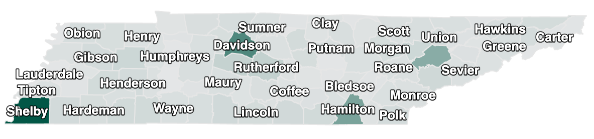
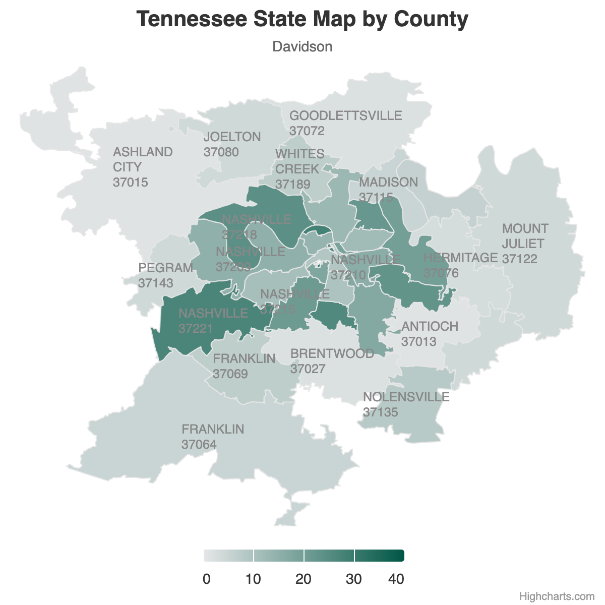

<head>
  <script src="https://cdn.jsdelivr.net/npm/bootstrap@5.3.3/dist/js/bootstrap.bundle.min.js"></script> 
  <link href="https://cdn.jsdelivr.net/npm/bootstrap@5.3.3/dist/css/bootstrap.min.css" rel="stylesheet">
  <link rel="stylesheet" href="assets/css/styles.css">
</head>

# Highcharts use in VMAC-DCC
*November, 2024*

**github url:** https://github.com/huiwu005/vmac_highcharts

This app includes **How to use QGIS?** to *filter by feature*, *edit feature*, *split by layer*, *join attributes by location*, *merge layers*, finally *export feature* to desired map based on zipcode information.

## 1. Highcharts
### Demos
https://www.highcharts.com/demo

### Highcharts Map code: 
https://code.highcharts.com/mapdata/

## 2. Two examples for map code with Zip Code
<div class="row text-middle">
  <div class="col-sm-6 text-center">
    <h4>Example 1: Drilldown to Zipcode map and use <i>javascript</i> file.</h4>
    <div class="border border-primary">
      
      
    </div>
  </div>

  <div class="col-sm-6 text-center">
    <h4>Example 2: Multi-layer with Zipcode map and use <i>geojson</i> file.</h4>
    
  </div>
</div>


## 3. Shapefiles on Census 
https://www.census.gov/geographies/mapping-files/time-series/geo/tiger-line-file.html

*Due to large file size, downloaded files are not included. Below files are suggested to download and used in two examples of this application.

- Counties (and equivalent) `tl_2023_us_county`
- ZIP Code Tabulation Areas `tl_2023_us_zcta520`
- *For e.g. 2* Landmarks &rarr; Area Landmark (Tennessee) `tl_2023_47_arealm`
- *For e.g. 2* Roads &rarr; All Roads (Tennessee &rarr; Davidson County 47037) `tl_2023_47037_roads`
- *For e.g. 2* Water &rarr; Area Hydrography (Tennessee &rarr; Davidson County 47037) `tl_2023_47037_areawater`

## 4. QGIS 
https://www.qgis.org/

- Import shapefiles downloaded from [Census](#3-shapefiles-on-census) to QGIS.
- Save splitted, joined, merged files, export and saved as *.geojson* at `assets/maps/qgis/`
- Other used file [uszips_hc-key.csv](maps/files/uszips_hc-key.csv)
  - Due to `tl_2023_us_zcta520` lack of information of *state*, *county* and *city name*, in order to split `tl_2023_us_zcta520` by county or state, filter `ZCTA5CE20` equals to `zip`s of `state_id = "TN"` for Tennessee or `county_name = "Davidson"` for Davidson County in [uszips_hc-key.csv](maps/files/uszips_hc-key.csv) file.
  - To present correct city name in *e.g. 1 Davidson Multi-layer*, modify `NAME` feature or add new feature like `CITY` in `tl_2023_47_county_join_zcta520_{ZCTA5CE20}` by `city` in [uszips_hc-key.csv](maps/files/uszips_hc-key.csv) file.

```
zip,lat,lng,city,state_id,state_name,zcta,parent_zcta,population,density,county_fips,county_name,county_weights,county_names_all,county_fips_all,imprecise,military,timezone,hc-key
00601,18.18027,-66.75266,Adjuntas,PR,Puerto Rico,TRUE,,16773,100.5,72001,Adjuntas,"{""72001"": 98.76, ""72141"": 1.24}",Adjuntas|Utuado,72001|72141,FALSE,FALSE,America/Puerto_Rico,us-pr-001
00606,18.16585,-66.93716,Maricao,PR,Puerto Rico,TRUE,,6231,54.3,72093,Maricao,"{""72093"": 82.28, ""72153"": 11.67, ""72121"": 6.05}",Maricao|Yauco|Sabana Grande,72093|72153|72121,FALSE,FALSE,America/Puerto_Rico,us-pr-093
```

### [Davidson Multi-layer Example](http://localhost:3000/maps/TN-Davidson.html) use below files
  - **Layer 1:** assets/maps/qgis/tl_2023_47_county/GEOID_47037.geojson
  - **Layer 2:** assets/maps/qgis/tl_2023_47_county_join_zcta520/tl_2023_47_county_join_zcta520_47037.geojson
  - **Layer 3:** assets/maps/qgis/tl_2023_47037_roads_IUS.geojson
  - **Layer 4:** assets/maps/qgis/tl_2023_47037_arealm_areawater.geojson


## 5. run this app
`php -S localhost:3000`
Then visit http://localhost:3000 on browser

